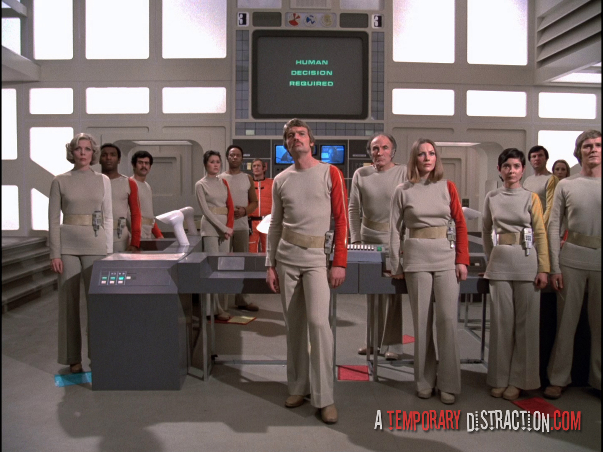
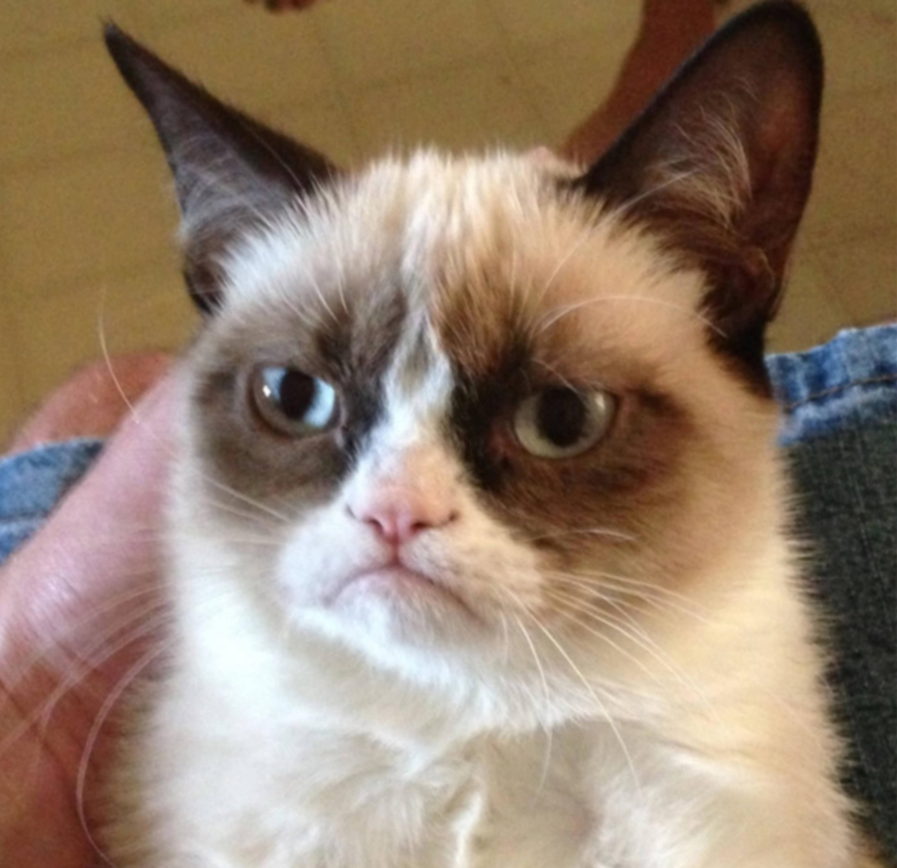

# [fit] no more
# [fit] unicorns

---
# [fit] C J Silverio
## [fit] devops at npmjs.com
## [fit] @ceejbot

^ It's lovely to see you all again from up here. I've had a transformative experience since I saw you last. I'm here to talk about that. Transformative experiences are always fun, aren't they? Here's the source of mine.

---

^ If you were paying attention to node, you remember this fight. For anybody with any experience in technical writing, it's a no-brainer. Correct style demands not dragging gender in where it doesn't need to be. But for the node core team, it was a big deal.

---

^ The discussion was the usual toxic mess, particularly after Hacker News got involved.

---

# [fit] THIS IS IN MY HOUSE.
# [fit] My community.

---

# [fit] So I looked up.
# [fit] I looked around.
# [fit] I saw a lot of nothing.

---

# [fit] What didn't I see?
# [fit] Women.

^ No women on node core, of course. Not a lot of women in open source. Estimates are hard to come by here, but it falls even further behind the percentage in our industry to start with. And no wonder, with idiots like the ones trolling that thread.

---

# the future!
## uh...

^ Friends, I thought the future would be better than the past. We like to praise ourselves for inventing the future & being on the forefront of this & that. So why are we so regressive? Why is Google's engineering staff 17% women if it's so forward-thinking? It's worse than it was, though.

---

# [fit] Yay. I'm a unicorn.

^ I'm a middle-aged woman who is a software engineer who contributes to open-source projects. Wow, that image doesn't fit me. Let's try this.

---

# [fit] More like this.

^ That's more like it. Frankly, I don't like being a unicorn. Let me tell you a little story about how much I don't like it.

---

# Community panel at Node Summit 2014

Late invitation because there were few women on the schedule.
@dshaw gave me a mic.
Brave man.

^ Last year I was on a panel at Node Summit talking about the node community. I was a last-minute invitation, prompted because the organizer had received some pressure about having no women on his agenda.

---

# [fit] the Node.js project
# [fit] should recruit
# [fit] women.

^ So I went on a mini-rant about how if you wanted to see women in open source, you had to stop wringing your hands about it. They aren't volunteering themselves and you probably aren't going to fix the social reasons why they aren't. If node wants women involved, it's going to have to recruit them. The leadership, the Node Core team, is going to have to recruit minorities. Put up or shut up.

---

^ Nothing happened. Okay. Now what?

---

# [fit] Let's figure this out.

^ So I did some thinking about women in node, women in software, women around me. I decided I was going to have to put up or shut up myself.

---

# [fit] How did I become
# [fit] a unicorn?

^ First step: I asked myself how I'd done it.

---

# [fit] stubborn &
# [fit] oblivious

^ Laura Lemay's phrase; totally awesome traits

---

# [fit] "Girls don't program computers!"

^ Let's try out stubborn & oblivious, shall we?

---

## [fit] Stubborn:

### [fit] Screw you; I'm going to do what I want.

---

## [fit] Oblivious:

## [fit] Sorry didn't notice.
## [fit] Too busy writing this module.

^ See? Totally awesome! End result is I write software!

---

# [fit] Not actually a good idea.

## [fit] Not everybody wants to be
## [fit] that thick-skinned.

^ In fact, I'll go one step further.

---

# [fit] People shouldn't
# [fit] have to be that
# [fit] thick-skinned.

^ Let's try some better adjectives. Ready?

---

# [fit] Determined
# [fit] & empathetic.

^ Aaaah. Lots better, huh? Much more positive. Let's look at how that plays out.

---

# [fit] Girls don't program computers!

---

## [fit] Determined:

## [fit] I'm going to do what I want.

^ Subtle change there. Do you see it?

---

## [fit] Empathetic:

## [fit] Who else has that guy
## [fit] driven off?

^ That guy has probably made somebody else's life miserable. I'll see if I can do something to help them.

---

# [fit] That's me.
# [fit] What about you?

^ What does this have to do with you? Yes you, oh person in the audience. I am talking to you. Painful truth time.

---

# [fit] how you act
# [fit] is what your
# [fit] values are

^ How you talk tells me nothing but what you think you should be, or how you think you should look to other people. How you act tells me what you value, really and truly.

---

# [fit] Do you truly value
# [fit] diversity
# [fit] in our profession?

^ Look at what you've done.

---

# [fit] How can I tell?

^ If you are a hiring manager, put your hand up.  I'm talking to you now.

---

## [fit] if your team looks like this
## [fit] it's because you
## [fit] didn't try.

^ It doesn't matter what your values are. You didn't act on them.

---

# [fit] RIP Mortimer Q Snerd
# [fit] He only worked on
# [fit] easy problems

^ But it's hard! You tell me. I know! But nobody's going to give you credit for doing easy things.

---

^ Stop. Adorable kitten. Remember that I love you, and I that I know this feels hard, and that you're wondering how to juggle your responsibilities with your values. You can do it, though.

---

# [fit] It's easier than you fear

^ The first thing you have to do is *try*. Remember: you're going to be determined & empathetic. Now we're going to talk about how.

---

# [fit] Congruence:

# [fit] harmony & agreement
# [fit] all signals aligning

^ Give examples: yes/no + yes/yes.

---

# Step one: say it clearly.

> We are not a typical early stage startup. We believe that working sensible hours and taking care of ourselves and our loved ones is the best way to ensure long-term productivity. We care deeply about making tech a more inclusive and diverse place.

-- yes, please apply

^ Signal in your job listings that this matters to you. Women & minorities tend to be conservative about job moves: they avoid situations that look like they'll be hell. Empathy here!

---

# Step two:
## enlist your existing employees to help.

^ Get all the women who are in your company now to interview every candidate. This is an amazing weeder: it signals to your women candidates that they'll be safe, and it drives off the asshats who would have trouble working with women.

---

# Step three:
## hire somebody
### who doesn't look like everybody else

^ This is where you need to be determined. I'm going to ask you to do something that feels risky if you've been making conservative, safe, boring choices, the same choices you've been making all along. But this is where you show the world that this issue matters to you.

---

# A terrible secret about our culture:
## men over-state
## women under-state

^ Remember that the candidate is *presenting themselves* as more junior than they are. The brash young guy who looks more senior probably *looks* that way but isn't-- culture has taught him to put himself forward. The women applying have been taught to understate their abilities. You can't fix that part of the culture overnight, but you *can* teach yourself to remember it when you're evaluating candidates.

---

# Hot tip:
## that candidate is probably
## undervalued. snag 'em while you can.

^ This won't always work out. Hiring doesn't always work out. But hey, you can always console yourself in this Machievellian way that you at least got that candidate cheaply.

---

## [fit] This is the npm team.
## [fit] @izs acted on his values.

^ My challenge paid off a couple months later. And guess what: he got a kick-ass team.

---

^ The future! now with 100% more jumpsuits

---

# what my fellow women can do

^ The hiring managers can stand down. Now I'm going to talk to my fellow women and women-identified friends in the audience. Wave at me please, so I can feel less unicorn-y. Hi! I just signed you up for extra work interviewing people. Sorry about that, but I think it'll pay off long-term. What I'm most worried about with you all is keeping you around.

---

# 50% of you leave after about 15 years.

---

^ This makes me sad.

---

# Be determined.
# Keep on keeping on.
# Do what you love.

^ If that's something else, awesome. But I'm going to be damned if anybody drives you off from something you love.

---

# [fit] my resolution:
# [fit] 2014 is the year
# [fit] I help other women.

^ At New Years I made a resolution: I was going to spend time in 2014 helping other women engineers any way I could.

---

# my new look

^ That's an icebreaker ship smashing its way through arctic ice. That's a great job for an oblivious stubborn person, I think. That's what I pledge to be for you.

---

# or maybe

^ I'll wear that horn because face it, that ice breaker looks extra-fierce.

---

# What about you?

^ That's me. That's my decision.
