# [fit] no more
# [fit] unicorns

---

# [fit] C J Silverio
## [fit] devops at npmjs.com
## [fit] @ceejbot

---

# [fit] I'm going to tell you a
# [fit] story

---

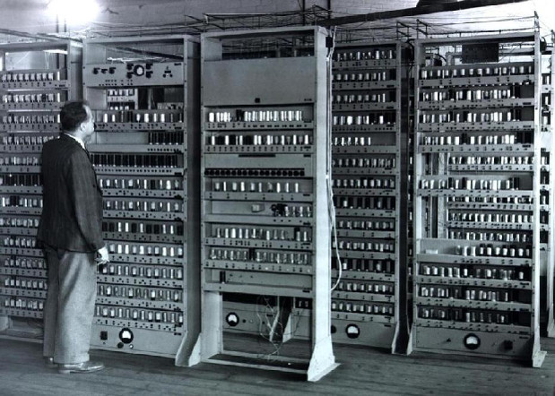

^ My father was a programmer when I was a kid. Janitor at GE. Saw they were hiring programmers. You take a test, you're hired. He spent the weekend studying. Took the test. Got the job.

---

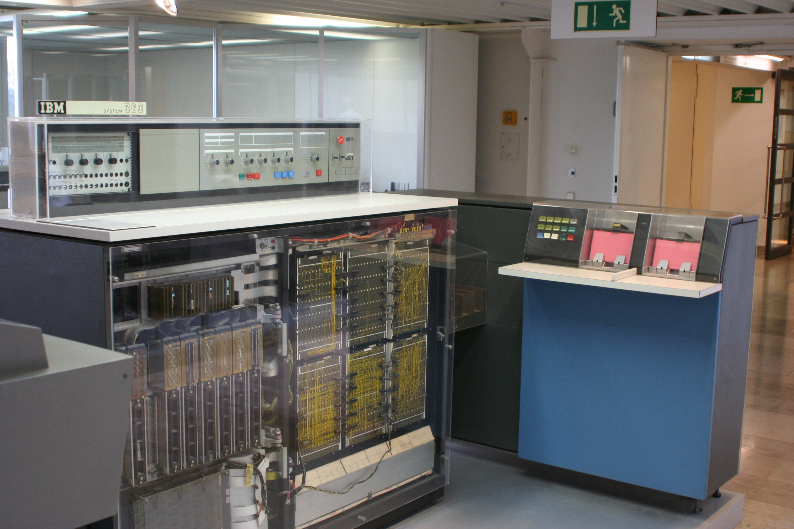

^ Years later he was a manager hiring programmers for Honeywell. He had an aptitude test he used to give him, a standardized thing. He gave it to me one day. I was around 13 or so. Awesome test. Way fun. Highest score he'd ever seen.

---

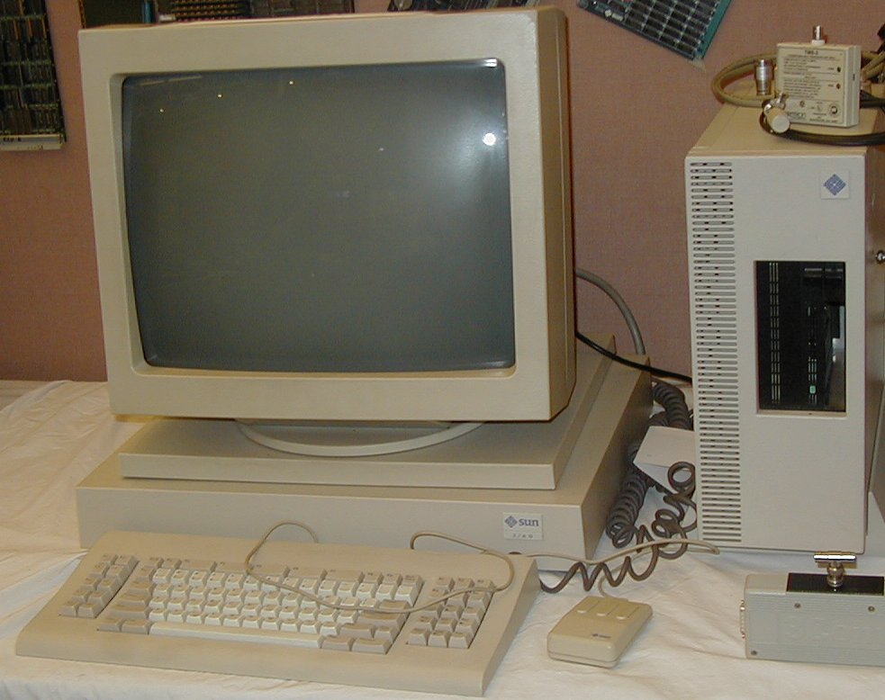

^ Fast forward a few more years: I'm in college. I'm a math major: loved me those patterns. I minor in CS. I get the math degree & go on to grad school. Turns out grad school wasn't for me.

----

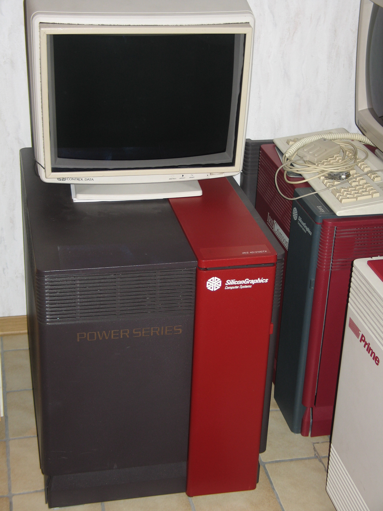

^ So I drop out & get a job. Do I become a programmer like my father? Nope. I become a techwriter. Programming is for people who majored in it. I don't know C. I can't possibly be good enough like those people.

---

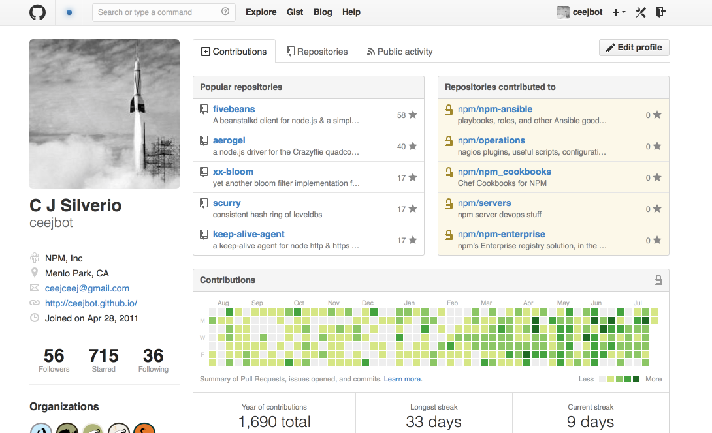

^ I got over that. Took me a few years & a manager willing to take a flier on me, but I jumped over to the profession that was waiting for me for all those years. I like it. One of these years I might be good at it.

---

# [fit] I have an awesome career
# [fit] working on some
# [fit] great projects.

---

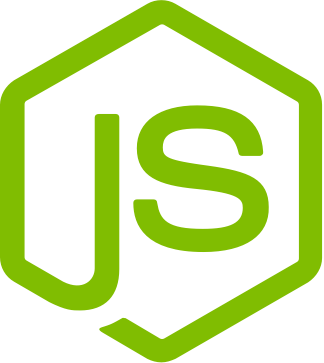

^ I get into node & it gets even better. I'm leading a little team building web services in node, getting to design the whole thing. Groovy. Then one day this happens.

---

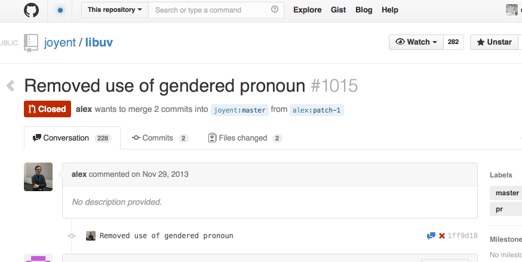

^ libuv gendered pronouns in doc; no-brainer if you're a writer, but apparently controversial to node core.

---

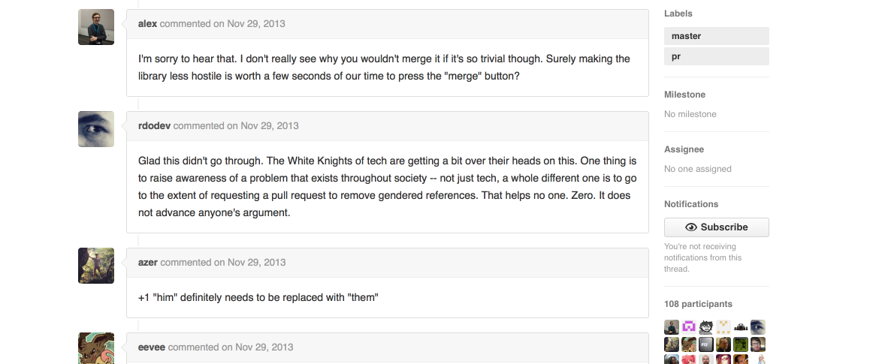

^ The discussion was the usual toxic mess, particularly after that YCombinator chat site got involved. The right thing happened in the end, but why was it an incident at all?

---

# [fit] why is my community telling me
# [fit] I don't belong?

^ This call is coming from inside the house. My house.

---

# [fit] THIS IS IN MY HOUSE.
# [fit] My community.

^ My chosen community telling me it will go out of its way to exclude me, using the stupidest means possible.

---

# [fit] So I looked up.
# [fit] I looked around.
# [fit] I saw a lot of nothing.

---

# [fit] What didn't I see?
# [fit] Women.

^ No women on node core, of course. 11% of open source developers are women. Look, this isn't what I expected.

---

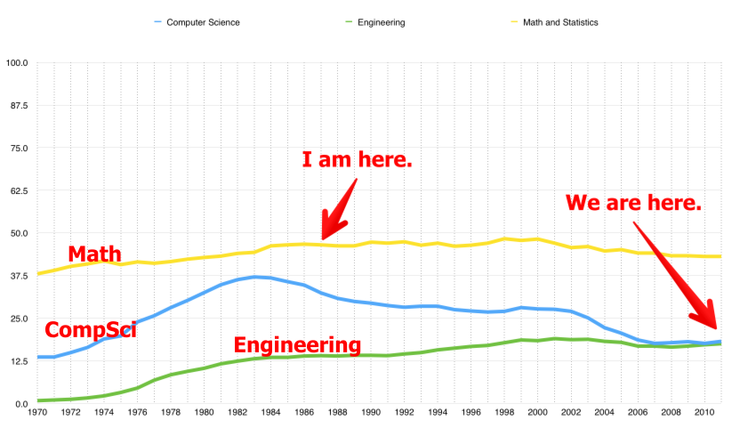

^ I'm on that math line, which has stayed pretty flat below 50% of the total degrees. Look at the CS line: it peaked *before* I graduated.

---

# [fit] Pipeline problem?

---

## [fit] Google: 17%
## [fit] 1998: 27%

---

## [fit] Yahoo: 15%
## [fit] 1994: 28.5%

---

## [fit] Facebook: 15%
## [fit] 2004: 22.2%

---

## [fit] Twitter: 10%
## [fit] 2006: 18.6%

^ Pipeline problem? I call that a "not trying" problem.

---

# [fit] our industry is
# [fit] regressive.

---

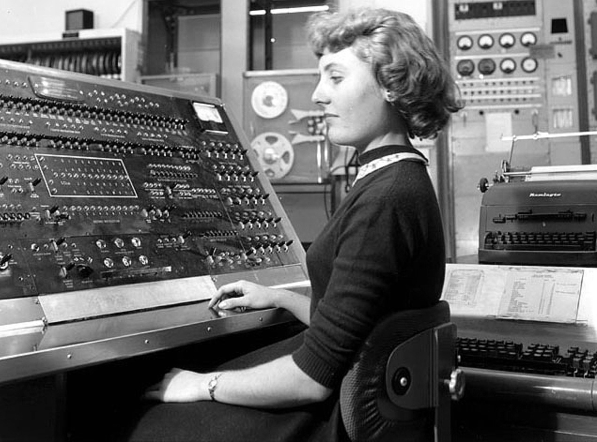

# the future!
## uh...

^ Friends, I thought the future would be better than the past. We like to praise ourselves for inventing the future & being on the forefront of this & that.

---

# [fit] Yay. I'm a unicorn.

^ Middle-aged woman who writes software, plays online games, works on OSS stuff: yes, I am a mythical creature. I do not exist.

---

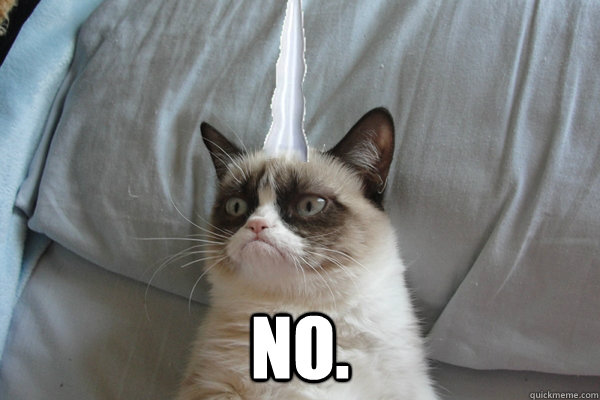

# [fit] More like this.

^ That's more like it. Frankly, I don't like being a unicorn. Let me tell you another way I don't exist.

---

# Community panel at Node Summit 2014

Late invitation because there were few women on the schedule.
@dshaw gave me a mic.
Brave man.

^ Plus the conf organizer "didn't know any women in node" so Raquel Velez had to give him a list. This was just after the pronoun nonsense, so I was grumpy.

---

# [fit] the Node.js project
# [fit] should recruit
# [fit] women.

^ Women aren't volunteering themselves for node involvement and you probably aren't going to fix the social reasons why they aren't. If node wants women involved, it's going to have to recruit them. The leadership, the Node Core team, is going to have to recruit minorities. Put up or shut up.

---

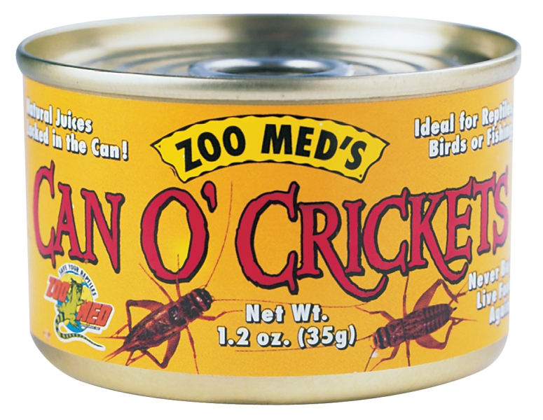

^ Nothing happened. Okay. Now what?

---

# [fit] Let's figure this out.

^ So I did some thinking about women in node, women in software, women around me. I decided I was going to have to put up or shut up myself.

---

# [fit] How did I become
# [fit] a unicorn?

^ First step: I asked myself how I'd done it.

---

# [fit] stubborn &
# [fit] oblivious

^ Laura Lemay's phrase; totally awesome traits. Let me show you them in action.

---

# [fit] "Girls don't program computers!"

---

## [fit] Stubborn:

### [fit] Screw you; I'm going to do what I want.

---

## [fit] Oblivious:

## [fit] Sorry didn't notice.
## [fit] Too busy writing this module.

^ See? Totally awesome! End result is I write software!

---

# [fit] Not actually a good idea.

## [fit] Not everybody wants to be
## [fit] that thick-skinned.

^ In fact, I'll go one step further.

---

# [fit] People shouldn't
# [fit] have to be that
# [fit] thick-skinned.

^ Let's try some better adjectives. Ready?

---

# [fit] Determined
# [fit] & empathetic.

^ Aaaah. Lots better, huh? Much more positive. Let's look at how that plays out.

---

# [fit] Girls don't program computers!

---

## [fit] Determined:

## [fit] I'm going to do what I want.

^ Subtle change there. Do you see it?

---

## [fit] Empathetic:

## [fit] Who else has that guy
## [fit] driven off?

^ That guy has probably made somebody else's life miserable. I'll see if I can do something to help them.

---

# [fit] That's me.
# [fit] What about you?

^ What does this have to do with you? Yes you, oh person in the audience. I am talking to you. Painful truth time.

---

# [fit] how you act
# [fit] is what your
# [fit] values are

^ How you talk tells me nothing but what you think you should be, or how you think you should look to other people. How you act tells me what you value, really and truly.

---

# [fit] Do you truly value
# [fit] diversity
# [fit] in our profession?

^ Look at what you've done.

---

# [fit] Hiring managers!

^ If you are a hiring manager, put your hand up.  I'm talking to you now. Why am I a unicorn?

---

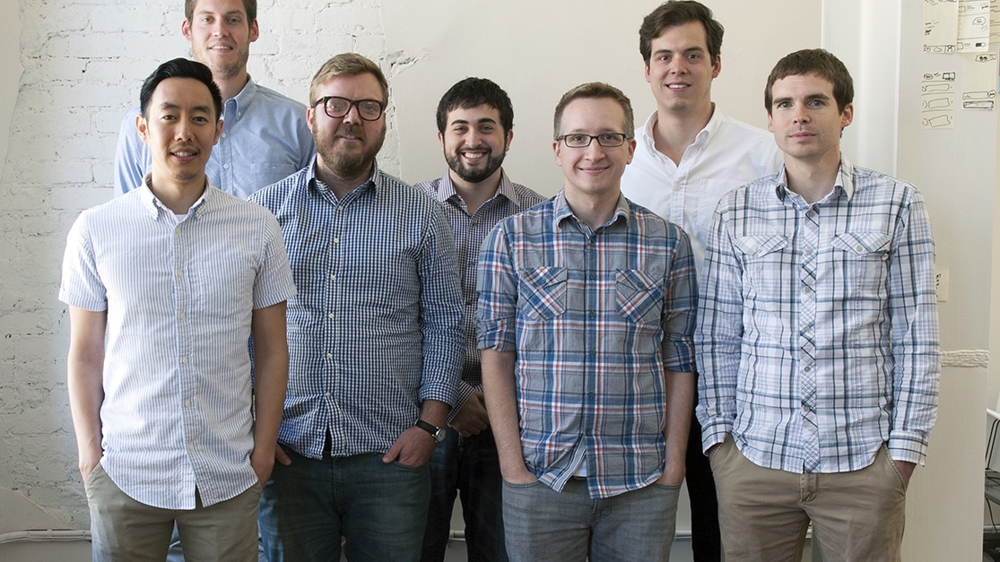

## [fit] if your team looks like this
## [fit] it's because you
## [fit] didn't try.

^ I'm pretty sure this team didn't value diversity, not really.

---

# [fit] RIP <your name here>
# [fit] You only worked on
# [fit] easy problems

^ But it's hard! You tell me. I know! But nobody's going to give you credit for doing easy things.

---

^ Stop. Adorable kitten. Remember that I love you, and I that I know this feels hard, and that you're wondering how to juggle your responsibilities with your values. You can do it.

---

# [fit] be determined
# [fit] It's easier than you fear

^ The first thing you have to do is *try*. Remember: you're going to be determined & empathetic. Now we're going to talk about how.

---

# Step one: say it clearly

> We are not a typical early stage startup. We believe that working sensible hours and taking care of ourselves and our loved ones is the best way to ensure long-term productivity. We care deeply about making tech a more inclusive and diverse place.

-- yes, please apply

^ Signal in your job listings that this matters to you. Women & minorities tend to be conservative about job moves: they avoid situations that look like they'll be hell. Empathy here!

---

# [fit] Step two:
## [fit] enlist your team's help

^ Get all the women who are in your company now to interview every candidate. Weeder: tells women they're safe, drives off jerks who would have trouble working with women.

---

# [fit] Step three:
## [fit] hire somebody
### [fit] who doesn't look like
### [fit] everybody else

^ This is where you need to be determined. I'm going to ask you to do something that feels risky if you've been making conservative, safe, boring choices, the same choices you've been making all along. But this is where you show the world that this issue matters to you.

---

# [fit] But Ceej, I can't do that.
# [fit] I can only hire the best.

^ Your interview process is probably horrible. People who already are great at the job they're doing right now are people who are going to be bored really soon.

---

# [fit] Hire people for who they'll become,
# [fit] not for what they are now.

---

# [fit] A terrible secret about our culture:
## [fit]men over-state
## [fit]women under-state

^ (remind about my story.) You can't fix that part of the culture overnight, but you *can* teach yourself to remember it when you're evaluating candidates.

---

## [fit] hot tip: that candidate is
## [fit] undervalued

^ This won't always work out. Hiring doesn't always work out. But hey, you can always console yourself in this Machievellian way that you at least got that candidate cheaply.

---

## [fit] This is the npm team.
## [fit] @izs acted on his values.

^ My challenge paid off a couple months later. Isaac took a risk. And guess what: he got a kick-ass team.

---

# [fit] Okay, guys.
# [fit] Your turn.

^ Men! Wave at me. I'm talking to you now.

---

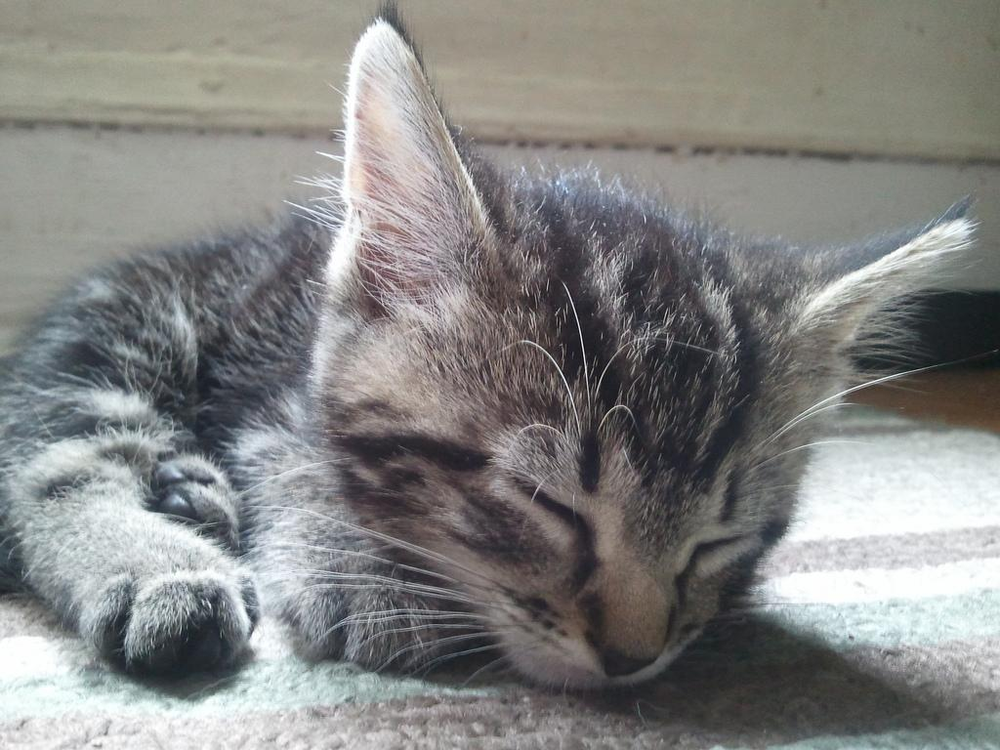

^ First, another kitten. Breathe! Kitten! I love you. Really, I do. I married one of you. Also, you've been my colleages for the last 25 years. You're not jerks.

---

# [fit] let's move beyond
# [fit] not being horrible

^ Bare minimum for being a decent human being. Let's do better.

---

# [fit] diversity is a win
# [fit] for you too

^ I know it looks like you're losing: I'm asking you to welcome your competition. But I keep hearing about a talent shortage.

---

# [fit] I need you to do something
# [fit] that I can't do.

^ I fully expect to get grief for this talk. I know it's not you, but it's somebody near you. Somebody who might tip you off.

---

# [fit] The standard you walk past
# [fit] is the standard
# [fit] you accept.

^ Lieutenant General David Morrison. What are you walking past?

---

# [fit] stop bad behavior
# [fit] when you see it

^ This is going to suck from time to time. This is what you can do that I can't do. I need your help. Be determined here and stand your ground.

---

# [fit] my fellow unicorns

^ Women, people who identify as women, anybody who doesn't match the white guy model.

---

^ No kittens for you. You get a lion. FIERCE. I'm not worried about soothing you. Worried about losing you from the profession.

---

# [fit] 56% leave
# [fit] by mid-career

^ If half of you leave by mid-career, it's no wonder I'm a unicorn.

---

# [fit] You can be great at this.

^ You're worth it. You're good at this already & you can be great. It's work, but being great at anything is always work.

---

# [fit] Apply for that job.
# [fit] it is so not over your head.

^ John W Campbell  “How dare you reject your story for my magazine?”

---

# [fit] Stay determined.
# [fit] I need company.
# [fit] \(Yes, I'm selfish.)

^ I love writing software. Do you like it? Is this a good career? Great pay. Good benefits. A way to stay middle-class in this new gilded age. Okay if you find something else you love better. I'll be damned if I see any more women driven out.

---

# [fit] I'm here for you.

---

# [fit] my resolution:
# [fit] 2014 is the year
# [fit] I help other women.

^ At New Years I made a resolution: I was going to spend time in 2014 helping other women engineers any way I could. I'm pushing 50. I don't want to be here in 2024 watching Twitter congratulate itself for hitting 12% women.

---

# my new look

^ That's an icebreaker ship smashing its way through arctic ice. That's a great job for an oblivious stubborn person, I think. That's what I pledge to be for you.

---

# What about you?

^ That's me. That's my decision. My parting shot: watch out, node core, I'm coming for you.
